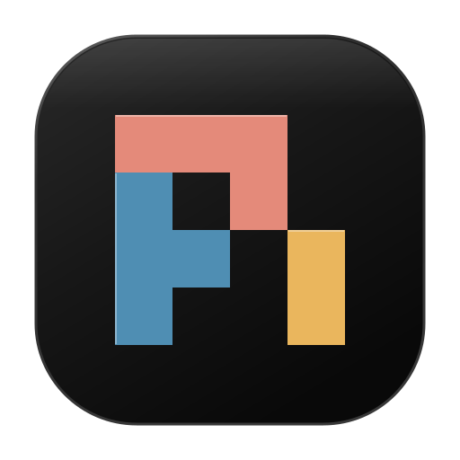

<p align="center">
  
</p>

<h1 align="center">Pi Companion</h1>

<p align="center">
  Read and reply to your computer's live Pi sessions from your phone over private Tailscale HTTPS.
</p>

<p align="center">
  <a href="#get-started">Get started</a> ·
  <a href="#screenshots">Screenshots</a> ·
  <a href="#how-it-works">How it works</a> ·
  <a href="#stack-limitations">Stack limitations</a>
</p>

---

> [!IMPORTANT]
> Pi runs on your computer. Companion connects to your existing sessions; it does not
> host another agent or move your sessions to a hosted service.

## Screenshots

Browser captures at a 390px-wide mobile viewport, using sample content—not photos of a
physical phone. Click an image for full size.

<table>
  <tr>
    <td valign="top">
      <a href="docs/screenshots/mobile-composer.png"></a>
      <p><strong>Read and reply.</strong> Inspect tool output and edits, then send text and image feedback.</p>
    </td>
    <td valign="top">
      <a href="docs/screenshots/sessions-drawer.png"></a>
      <p><strong>Switch sessions.</strong> Find your live Pi terminals by name and working directory.</p>
    </td>
  </tr>
</table>

See also: [Steer and Follow-up input](docs/screenshots/follow-up.png).

## What you can do

- **Interact remotely:** switch between live Pi sessions, read tool output and code
  diffs, and send text. Choose Steer or Follow-up while Pi is busy.
- **Inspect images:** open tool-generated screenshots and images at full size and zoom
  in to check details.
- **Send visual feedback:** pick or paste up to four PNG/JPEG/WebP images with your text,
  and preview or remove them before sending. Current media support is still images,
  not audio or video.

The [usage guide](docs/usage.md) covers native commands, model selection, session renaming,
optional questionnaires, and browser controls.

## Get started

### First time

Follow the [setup guide](docs/setup.md) to install dependencies, build Companion, register
its bridge, and fully restart Pi. This currently requires a development checkout, not a
standalone published installer. Setup has been checked on macOS; see the guide for exact
Pi and Node requirements and verification limits.

For phone access, sign in to Tailscale on both your computer and phone. Keep tailnet
access restricted to the owner.

### After setup

Run these commands from the Companion checkout with Pi running. Replace the example
hostname with your computer's exact Tailscale DNS name:

```sh
npm start -- start --origin https://companion.example.ts.net --port 4317
npm start -- pair
```

Open that HTTPS address on your phone, enter the pairing code, and choose a live session.
Device access options and expiry are covered in the [pairing guide](docs/setup.md#3-pair-and-remember-your-device).

Commands use `tailscale` from PATH. If it is missing or uses an unsupported macOS wrapper,
see the [CLI workaround](docs/setup.md#if-companion-cannot-find-the-tailscale-cli).

Already running? Open the same address. To rebuild and restart the managed gateway:

```sh
npm run restart
```

Pi sessions stay running. For bridge updates and safe recovery, follow
[stop, restart and reconnect](docs/setup.md#stop-restart-and-reconnect). You can also [add Companion to your phone's home screen](docs/setup.md#install-on-your-phone)
or use [local HTTP mode without Tailscale](docs/setup.md#manual-local-http-mode).

## How it works

```text
Pi terminals + Companion bridge
              |
       Loopback gateway
              |
   Private Tailscale Serve (HTTPS)
              |
        Your phone browser
```

Pi owns the agent, tools, settings and conversation history. Companion provides a
browser viewing and input surface, not a replacement terminal or a second transcript
store. Closing the browser or gateway does not stop Pi.

Access requires pairing. Reconnecting does not send input or acquire control.

> [!WARNING]
> Browser access can control an agent with your computer user's permissions. Restrict
> Tailscale access to the owner. Pi and its extensions are trusted code, not a sandbox.
> Never put pairing codes or credentials in URLs or logs.

See [architecture and boundaries](docs/architecture.md) for code ownership,
authentication, session identity and media handling.

## Stack limitations

- **Input dispatch is not a completion receipt:** Pi's public input API returns no
  confirmation that Pi consumed or completed the input. Companion can report forwarding,
  but a lost response leaves the outcome uncertain. See [uncertain outcomes](docs/usage.md#control-and-uncertain-outcomes) before retrying.
- **Stop is not a cancellation receipt:** Pi's abort API does not confirm cancellation
  of every queued input or background job. Companion observes parent settlement;
  parent idle does not prove that all work ended.

## Documentation

- [Setup and runtime](docs/setup.md): prerequisites, installation, pairing, phone access
  and updates.
- [Usage](docs/usage.md): browser input, native commands and session controls.
- [Architecture](docs/architecture.md): technologies, ownership and security boundaries.
- [Contributor guide](AGENTS.md): scope, safety, tests and review.
- [Screenshot maintenance](docs/setup.md#refresh-these-screenshots): regenerate the sample captures.
- [Extension display contract](docs/extension-display.md): trusted publisher API.
- [Questionnaire integration](integrations/README.md): exact-version source restoration
  and upstream license; no global installation.
- [Native probes](probes/README.md): isolated opt-in commands and their limits.

Pi Companion is licensed under the [MIT License](LICENSE). Third-party material retains
its upstream license notices. Packaging and publishing remain separate decisions.
