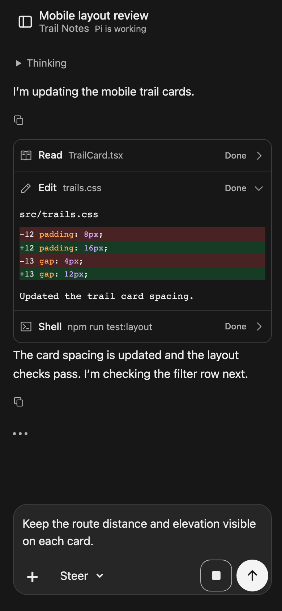
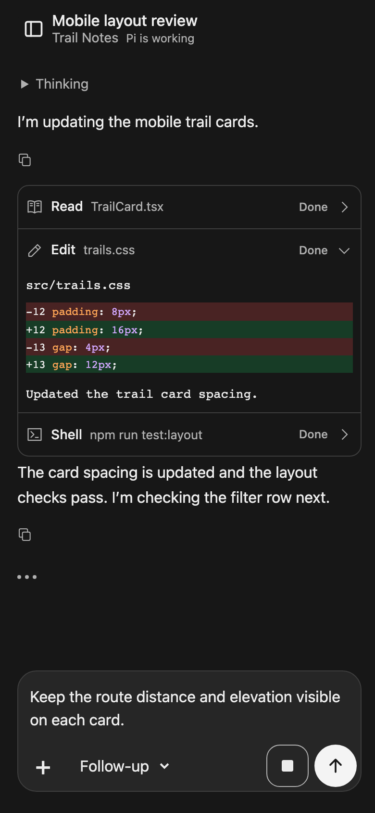
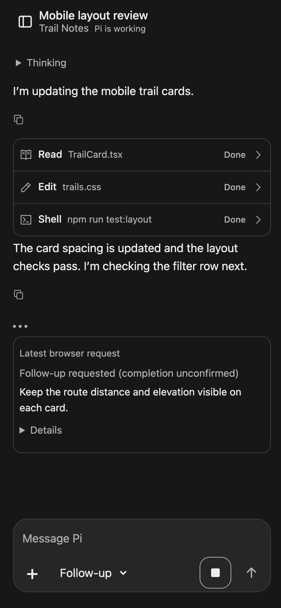
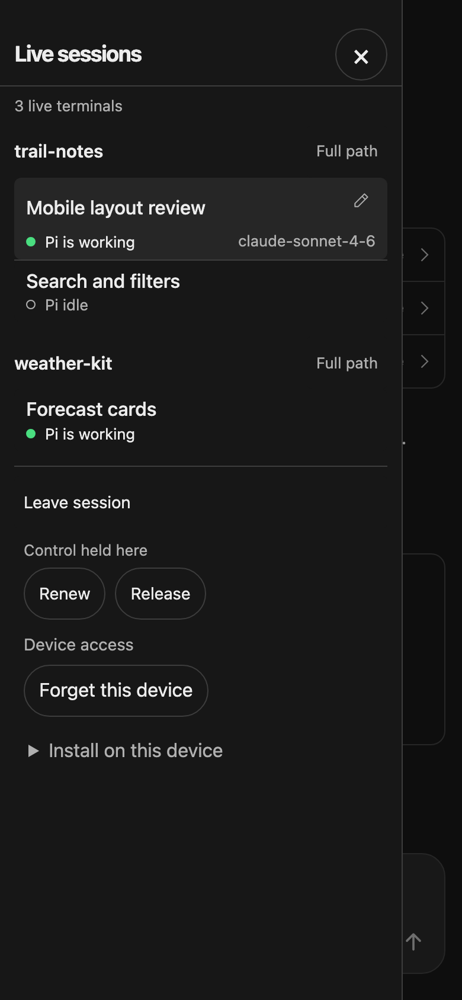

# Pi Companion

See and interact with your running Pi terminal sessions from a local browser or your
phone. Review tool-generated screenshots at full size, send image feedback, and switch
between sessions without starting another agent.

Pi remains the agent. The companion is a private viewing and input surface, not a
replacement for Pi's terminal, tools, extensions or conversation storage.

## Features

- **One dashboard for your Pi terminals:** sessions are grouped by exact working
  directory, with the most recent directory first and newest sessions first within it.
  Directory headings sit above full-width session rows.
  Same-named folders in different locations stay separate and show their parent paths.
  **Full path** opens a dismissible path popover beside each directory heading.
  Status dots and labels show observed activity and questions needing answers. The drawer shows the selected session's
  model and rename pencil in its session row. The top shows only the live-terminal count.
  A separate compact footer keeps Leave session, browser control and Device access visible.
  On narrow screens, drag from the left edge to open
  the drawer, then drag left inside it to close. The drawer and backdrop follow your finger;
  release speed sets the remaining animation duration. Reduced motion removes the settling animation.
- **Image inspection:** tap native tool-returned images to enlarge/zoom them, without an
  extra frame or visible caption. Image buttons retain accessible labels and keyboard focus.
- **Readable tool output:** inspect compact tool stacks, filename and command summaries,
  execution states, highlighted code and added/deleted edit lines. Expand only the output you need.
- **Text and image feedback:** narrow-screen drafts stay on one row until they wrap, then use a full-width editor above the actions.
  Pick or paste up to four PNG/JPEG/WebP images into the composer.
  Preview/remove them locally before sending together. Send acquires free browser control for idle
  text or an image; pasting alone never sends or takes control.
- **Busy text:** choose Steer or Follow-up beside **+**, then tap the send arrow,
  without stopping Pi. Review the latest request's text and mode
  in an expandable receipt; it is not Pi's live queue.
- **Native slash commands:** run `/new` and `/reload` in the existing Pi terminal, or
  choose a model in the browser with `/model`. Prompt templates and skills remain available.
  Suggestions appear above the input; unverified commands stay terminal-only.
- **Direct actions:** Send, questionnaire responses, Rename and Stop acquire free control
  when clicked. Another browser holder still requires a separate explicit takeover.
- **Explicit Stop:** request that Pi stop its current parent activity while keeping
  terminal input available.
- **Supported questions:** answer the same live questionnaire as the terminal when
  the optional source integration is restored and enabled.
- **Private phone access:** use Tailscale HTTPS; reconnect after locking the phone or
  closing the browser without transferring ownership away from the Pi terminal.

## Screenshots

Actual browser UI at a 390px-wide mobile viewport, using sample sessions and conversation
content. These are browser captures, not photos of a physical phone. Click an image for full size.

<table>
  <tr>
    <td valign="top">
      <a href="docs/screenshots/mobile-composer.png"></a>
      <p><strong>Read and reply.</strong> Expand native tool output and inspect highlighted edits. A wrapped mobile draft gets the full input width; Stop stays separate.</p>
    </td>
    <td valign="top">
      <a href="docs/screenshots/follow-up.png"></a>
      <p><strong>Choose busy delivery.</strong> Select Steer or Follow-up beside +, then use the arrow to send. Changing the mode sends nothing. Enter uses the selected mode; Alt+Enter requests Follow-up directly.</p>
    </td>
  </tr>
  <tr>
    <td valign="top">
      <a href="docs/screenshots/request-receipt.png"></a>
      <p><strong>Review what you requested.</strong> The latest successful Steer/Follow-up request has a text preview and expandable details. Delivery completion and queue position remain unconfirmed; the receipt disappears on reload.</p>
    </td>
    <td valign="top">
      <a href="docs/screenshots/sessions-drawer.png"></a>
      <p><strong>Switch between live terminals.</strong> Sessions are grouped by working directory. The selected model and rename pencil stay inside its row. Leave, control actions and Device access sit below the list.</p>
    </td>
  </tr>
</table>

### Refresh these screenshots

After the [development setup](#install-and-build-from-the-checkout), run from the repository root:

```sh
# Once, if the project's Chromium binary is not installed:
PLAYWRIGHT_BROWSERS_PATH=.cache/playwright npx playwright install chromium

# Rebuild the current UI and regenerate all four images:
npm run screenshots
```

[`scripts/screenshots.mjs`](scripts/screenshots.mjs) serves the built UI on a temporary
loopback port and uses Playwright with isolated sample API responses. It does not connect
to the running gateway, read private sessions, call a model, or change browser access.
It closes its browser and server after capture. The command overwrites only the four
images in `docs/screenshots/`; review the images and captions together before committing.
Update the sample scenario in the script when the illustrated journey changes.

## Browser input

The composer starts with +, text and Send on one compact row inside a rounded
surface. Use the header button to open sessions; the editor has no duplicate sessions button.
Short drafts use all the available editor width on that compact row. Once text wraps or
contains a newline, the editor gets a full-width row above the actions.
Shortening the draft to fit restores the compact row. An available busy-mode selector
keeps the editor above the actions. Text grows upward
as it wraps and scrolls natively after a height cap. CSS owns the shell layout, with the
composer in normal flow and the conversation in its own scroll area. One viewport adapter
adjusts only shell geometry at normal zoom. After viewport changes, page movement, app return,
orientation, focus or input, it remeasures each animation frame for one second after the
last event, then stops. This covers late keyboard or dictation measurements without
permanent polling. Unchanged measurements do not rewrite styles. Matching viewports,
invalid readings and pinch zoom remove overrides and use CSS viewport sizing instead
of retaining an old keyboard-sized shell. The adapter does not reset focus or scroll,
change drafts, reload the page or send input. The sessions drawer and model picker use
that same geometry so their scrollable contents and actions fit the visible area.
Text sizing stays at 100% to prevent Safari's automatic rotation
inflation; pinch zoom and explicit text enlargement remain available.
Uncertain input uses one outcome receipt with Details and explicit Retry;
a simultaneous browser-control blocker remains separate. Notices scroll within a bounded
area rather than pushing the editor offscreen.
Picking multiple images or pasting repeatedly appends local thumbnails in a horizontal
row above the editor; each image can be removed before sending. Short keyboard layouts
retain readable notices and complete touch targets without covering the delivery selector. Jump to latest is a floating circle centered above the composer, not a separate
row or full-width overlay. Pressing Jump to latest keeps the editor focused so keyboard
closure cannot move the button before release; the click scrolls to the newest content.
The session name, project and activity share one compact
header; long names are shortened visually, with full identity retained in the accessible
session button and drawer. Keyboard focus uses a small neutral ring around the drawer
icon, not a full-width header highlight; the whole header button remains tappable.

Conversation spacing and code padding are compact without reducing text or touch-target
sizes. Hover feedback applies only on hover-capable devices; pressed buttons have transient
feedback. Selected rows retain their own highlight, and keyboard focus remains visible,
including image controls inside the scrolling conversation. Assistant messages omit visible
Pi headings while retaining accessible identity. Native Thinking stays collapsed until
opened and retains that choice while the same item updates. Observed active work uses
three subtle dots with an accessible activity label; reduced-motion mode shows static dots.
Consecutive tool results share compact icon-labelled stacks; each output expands independently.
Recognized native file tools show the filename; shell tools show the command. The full
bounded path or command is available inside the disclosure. Native execution events show
Running; finalized results show Done or Failed, with a short failure preview visible without expanding. Nested calls appear
only while observed running; their output remains owned by the parent tool. Progress is sampled
on existing gateway refreshes, so short calls may finish between observations.
Successful native edits expose their structured diff with distinct added/deleted backgrounds;
result text stays available. Lowlight highlights fenced code, native Read output and edit
diffs using the fence language or file extension, rendered as escaped React elements.
Unknown languages and code over 100,000 characters stay plain text; shell logs and
Edit/Write receipts are not interpreted as source code. Highlighting does not change copied text.
Copy answer copies the displayed answer's Markdown text, not reasoning or tool output;
shortened answers remain previews, not the full native history. A small muted Copy icon sits
just below each answer, aligned with the text, inside a 44px touch target. Code copying
stays separate.
The selected session row places its observed model at bottom-right beside the activity
status, with the rename pencil at top-right. Long model names wrap when needed. Context usage is not displayed.
Markdown tables keep readable natural column widths in a separate horizontal scroll area,
with Left/Right-arrow controls when that area is focused. They do not widen the page.

The send button uses an arrow in both idle and busy states. While busy text is available,
a **Steer / Follow-up** selector appears beside **+**. Tapping the arrow or pressing
unmodified **Enter** in the editor requests the selected mode. Its accessible label is
**Steer** or **Send Follow-up**. Changing the mode sends nothing. The selection remains
visible after sending, and resets to Steer when Pi becomes idle or you switch sessions.
Idle Send is unchanged. There is no hold menu or separate Follow-up button.
Pressing the arrow keeps the editor focused until the click completes, so keyboard closure
cannot move Send before release. The click requests dispatch and then closes the keyboard;
a canceled press or scrolling gesture does not send.
**Alt+Enter** in the editor requests Follow-up directly without changing the selection.
**Shift+Enter** inserts a newline; Stop stays separate. Pi owns steering boundaries and follow-up timing;
these requests do not interrupt a running tool.
Steer uses Pi's next steering boundary; Follow-up waits until after the current run.
This guidance does not reserve conversation or composer space. The latest successful browser Steer/Follow-up request
has one receipt with a compact text preview and expandable full text, mode and request
identity. It replaces the prior receipt; it is not another transcript or Pi's live queue.
The receipt remains an observation of dispatch, not confirmation that the message is
still waiting or was consumed. It is kept only in memory and disappears on page reload.
Status says **requested**, not confirmed queued or processed. Multiple deliberate requests
are allowed. Lost responses retain the original ID/text/mode for explicit retry; refreshing
or reconnecting never resends input. Busy image attachments remain local and must be
removed before requesting busy text. Their routine explanation stays in the editor's accessible description, not above the thumbnails. Safety and error
notices remain visible.

While Pi is idle, type `/` for suggestions from that selected session. The scrollable
suggestions appear above the input as compact command-and-description rows. Terminal-only
extension commands are not suggested. Typing `/` or a matching prefix shows no warning.
Tap a supported native command, prompt template or skill, or use Arrow keys and Enter/Tab to select,
then tap **Send**. Selection only edits the draft; Escape closes suggestions.
Prompt-template and skill arguments remain unchanged.

### Native commands

Companion uses the public custom-editor hook to reach Pi's existing terminal submission
handler. It does not copy command implementations, send these commands to a model,
modify Pi source, or simulate terminal keystrokes.

- `/new` starts a fresh native conversation. The old browser view is cleared; Pi remains
  the history owner. The terminal process and Companion instance remain the same.
- `/reload` reloads Pi resources and replaces the bridge generation without replacing
  the terminal or native session. Companion follows the same instance with fresh authority.
  After observing Pi's native reload event in a new live snapshot, Companion shows
  **Pi reloaded** for four seconds. Dispatch alone, refresh and session selection do not
  show this confirmation; uncertain command receipts remain unresolved.
- Selecting `/model` in autocomplete (tap or Enter/Tab), or submitting bare `/model`,
  opens a scrollable list from Pi's available model snapshot, limited to its scoped models
  when configured. Choose a model with touch or the radio group's Arrow keys.
  **Use model** writes `/model provider/model` into the draft; **Send** executes Pi's
  native command. Opening the list and choosing a model never claim control or send input.
  Cancel/Escape sends nothing. At most
  128 models within a 65,536-byte catalog are shown. Use the terminal for other models.

These native commands require idle Pi with no queued input, no images, and an empty
terminal draft. If the terminal contains unsent text, clear or send it there first.
If another extension replaces the editor after the bridge installs its hook, native
commands become unavailable rather than calling a stale editor.
Forwarding is not a completion receipt. A lost response retains the command and original
identity. Native commands have no retry button: inspect Pi, then **Dismiss command receipt
without retrying** before making another deliberate request. Reload, reconnect and session
changes never resend input or acquire browser control automatically.

| Terminal-only commands                                                                                 | Why                                                                                                                                           |
| ------------------------------------------------------------------------------------------------------ | --------------------------------------------------------------------------------------------------------------------------------------------- |
| `/settings`, `/thinking`, `/scoped-models`, `/tree`, `/fork`, `/resume`, `/clone`, `/import`, `/trust` | Their terminal interaction or session workflow has no verified browser adapter in this slice.                                                 |
| `/login`, `/logout`                                                                                    | Provider authentication remains terminal-owned; no browser credential flow is implemented.                                                    |
| `/export`, `/share`, `/bug`, `/compact`, `/quit`                                                       | File, publication, provider-call or process-exit effects are outside this command slice.                                                      |
| `/copy`, `/name`, `/session`, `/changelog`, `/hotkeys`, terminal-only novelty/debug commands           | Use the terminal. Companion's existing Copy answer and Rename controls remain available separately.                                           |
| Extension commands                                                                                     | Arbitrary dialogs and custom terminal components are not browser-mirrored. Their interaction and authority must be verified before admission. |

Unknown commands, unsupported native commands, busy slash input and slash-with-image input
are rejected, never sent as ordinary model text. This is not full terminal-command parity.
The hook and native lifecycle are tested on Pi **1.0.1** with isolated no-inference fixtures;
this is not a compatibility claim for another Pi version or a physical phone.

Pi loads the bridge's TypeScript source entry through its extension loader; the gateway
still uses the compiled build. This lets native `/reload` load bridge changes instead of
reusing a compiled JavaScript entry cached by the owning process. The hook captures the
editor after the remaining synchronous session-start handlers, preserving editor extensions
such as Pi Vim. A later editor replacement still disables native command admission.

For an existing terminal with the old bridge, activate the update once through native
terminal `/reload` while Pi is idle and its editor is empty. This retains the process and
native session. A terminal manager may send that exact command after verifying the owning
process, idle state and empty editor; it must not clear a draft or retry uncertain delivery.
After activation, Companion's `/reload` uses the native callback directly, with no terminal
manager dependency. Restart the known gateway with its existing origin/runtime/auth directory
and refresh the browser for UI updates. Initial package installation still requires the full
Pi restart [described below](#1-register-the-bridge-once-then-restart-pi-fully).
Remembered access does not need a new pairing code.

## Rename a session

Open **Live sessions**. The drawer heading and Close remain available while its contents
scroll. The rename pencil appears beside the selected session's row.
Choose the pencil (**Rename session**), edit the native name, then select **Save** or **Cancel**. Names must be nonblank and at most 120 UTF-16 units. Save uses
Pi's public session-name API, not model input or a browser name store. Older bridges
without rename support do not offer the action.

Cancel/Escape before forwarding cancels preparation; it cannot undo a forwarded rename.
An uncertain response retains the original owner/name without resending. Check the native
name before acting again. A displayed native name is an observation, not proof of a
per-request durable commit. Automatic naming remains the naming extension's responsibility.

## Architecture and philosophy

```text
Pi terminals (each owns its session)
  + companion bridge
          | private Unix-domain sockets
Loopback gateway (127.0.0.1)
          +---- local browser (manual HTTP mode)
          +---- private Tailscale Serve (HTTPS) ---- phone browser
```

Pi owns behavior, history, tools, settings and subagents. Each terminal remains the
session owner; the gateway never creates a second agent or writes a parallel transcript.
Browser control is explicit, access requires pairing, and uncertain input is never
silently resent. Closing the browser or gateway does not stop Pi.

### Code ownership and technologies

- `src/extension/`: public Pi events, active-branch snapshots and native dispatch.
  It loads inside existing terminal sessions; print/JSON/RPC sessions do not register.
- `src/gateway/`: Fastify HTTP routing, authentication, control, media and managed runtime.
  Node HTTP uses private Unix-domain sockets to reach bridges. `fs-ext` holds the
  gateway's process-lifetime lock; PID/mtime guesses do not establish ownership.
- `src/shared/`: TypeBox schemas and browser-safe identity/transport contracts.
- `web/src/`: React/Vite presentation, deliberate actions and one selected-session
  EventSource (SSE) subscription. Native dialog provides the session drawer;
  react-markdown/remark-gfm render text and PhotoSwipe provides image inspection.
- `scripts/`: declaration-link setup, managed restart and sample-data README screenshot generation. `tests/` uses Vitest and
  Playwright fixtures. `probes/` contains explicit isolated native-Pi checks.

The package uses strict TypeScript and native ESM with pinned npm dependencies. Keep
one package and one owner for each policy; do not add a second Pi runtime or transcript
store. The [contributor guide](AGENTS.md) governs changes and validation.

### Identity, input and media boundaries

A live owner is an instance **and generation**, not a PID or saved session file.
Lifecycle changes invalidate old generations. If two processes advertise the same
canonical session file, browser mutation is refused as an ownership conflict. Native
session paths stay server-side; cached/disconnected content is read-only. SSE uses
bounded replay, heartbeats and fresh snapshot fallback, not a duplicated transcript.

Browser mutations require authenticated exact-origin/CSRF admission and current control.
Takeover is separate from a blocked action; it never resumes that action. Terminal input
remains available. Generation-scoped request ledgers prevent reinvoking an attempted ID;
forwarding through Pi's void public API is not proof of consumption or completion.
Stop observes parent settlement, not cancellation of all queued or background work.
Positive Subagents observations show work-item counts and public labels, not exact child
counts. Missing/zero background status is unknown, not proof that work ended.

Returned images come from native Pi image blocks through authenticated, owner-scoped
opaque references. A model-authored file path is not permission to read an arbitrary
file. Uploads are limited to four still PNG/JPEG/WebP images per message, 4,000,000 total
source bytes and 4,000,000 total normalized bytes, with 20,000,000 pixels per image. The gateway validates and re-encodes with sharp, applies orientation
and strips metadata; Pi retains its own model/image policy. Decoder work stays outside
Pi event handlers. Its timeout is cooperative, not a hard CPU/memory/wall-clock sandbox.

Treat browser access as control of an agent with the host user's permissions. Loopback
binding alone is not authentication. Local IPC records/sockets are owner-only; capability
values never belong in browser responses or ordinary logs. HttpOnly cookies and bounded
schemas protect entry points. Untrusted text uses no raw HTML or executable link schemes;
remote image paths, arbitrary files and third-party content fetching are not enabled.
Pi and loaded extensions are trusted code, not an OS sandbox. Tailscale access rules must
restrict access to the owner; private Serve does not make agent actions harmless.

Trusted extensions may contribute read-only plain-text cards during existing status reads.
These cards, including Subagents, sit at the bottom of the conversation and scroll away
when reading earlier messages; they do not reserve space above the message scroller.
See the [extension display contract](docs/extension-display.md) for publisher rules and
bounds. Displays never grant control or alter input policy; publishers must omit secrets
and private state. There is no widget mirror, action API, display history or extra poller.

## Prerequisites

This currently runs **from a development checkout**, not a standalone published
package. Have a local checkout of this repository before following the steps below.

| Requirement           | Current support and setup                                                                                                                                                                                                                                                                                                                                                                                                                                                                       |
| --------------------- | ----------------------------------------------------------------------------------------------------------------------------------------------------------------------------------------------------------------------------------------------------------------------------------------------------------------------------------------------------------------------------------------------------------------------------------------------------------------------------------------------- |
| Pi                    | **0.99.2** is the earlier checked baseline; **1.0.1** is checked against the installed host's public bridge APIs, local fixtures and read-only live observations. Install Pi and authenticate/configure its provider separately; `pi` must be on your PATH and work in your project terminal. See [Pi's official getting-started instructions](https://github.com/earendil-works/pi/blob/main/packages/coding-agent/README.md#getting-started). Do not infer support for the latest Pi version. |
| Node.js and npm       | Tested with **Node 26.5.0 and npm 11.17.0**. Node 24 is a proposed baseline, not runtime-verified.                                                                                                                                                                                                                                                                                                                                                                                              |
| Operating system      | Tested on **macOS**. Linux/Windows compatibility is not established.                                                                                                                                                                                                                                                                                                                                                                                                                            |
| Native build tools    | A compiler/toolchain for the required `fs-ext` native build (on macOS, Xcode Command Line Tools).                                                                                                                                                                                                                                                                                                                                                                                               |
| Python                | **Python 3**, used by the declaration-link bootstrap below and the native build tooling.                                                                                                                                                                                                                                                                                                                                                                                                        |
| Optional phone access | Tailscale installed and signed in on the computer and phone, both on the same tailnet, with access restricted to the owner. HTTPS feature consent may be required.                                                                                                                                                                                                                                                                                                                              |

The companion does not install Pi or set up provider credentials. Optional personal
registration uses Pi's local-package command to add only this package to your resource
settings. It does not replace unrelated settings or bundle another Pi runtime.
Development setup links to the existing installed Pi declarations.

## Install and build from the checkout

Run these steps in the **companion repository root**. Replace `/path/to/pi-companion`
with your local checkout path. Stop on any command failure rather than continuing.

### 1. Install locked dependencies with scripts disabled

```sh
cd /path/to/pi-companion
COMPANION="$PWD"
npm ci --ignore-scripts
```

### 2. Inspect and build the required native dependency

```sh
cat node_modules/fs-ext/package.json node_modules/fs-ext/binding.gyp
```

The required hook is `node-gyp configure build`, targeting local `fs-ext.cc` with
NAN headers. After inspecting that hook and target, build only this dependency:

```sh
npm rebuild fs-ext
```

Do not enable arbitrary dependency install scripts or override npm release-age policy.
Plain `npm ci` alone is **not** a complete bootstrap.

### 3. Link the installed development declarations

Run this command from the companion root after **every `npm ci`**. It checks
the installed Pi and pi-ai versions, then creates the two ignored development links.
The pi-ai declarations are needed by the existing test fixture in the strict check.
Existing packages or mismatched links are not overwritten. These links are for
read-only use of installed declarations; do not edit installed package files.

```sh
npm run setup:types
```

The checked-in [declaration-link script](scripts/link-pi-declarations.py) validates
both destinations before creating either link. Repeating it is safe when both links
already match; it refuses existing packages and different links without replacing them.

The setup has been checked in an isolated source copy on macOS using the existing Pi
host, npm cache and browser engines. This is not a clean-machine/network-download or
wider compatibility guarantee.

### 4. Check and build

```sh
npm run typecheck
npm run build
```

For the complete local fixture gate, with Chromium/WebKit installed under
`.cache/playwright`, run:

```sh
npm run check
```

This runs typecheck, build/unit/process checks, then build/browser checks. Both
`npm test` and `npm run test:browser` build first, so their fixtures cannot silently
use an older `dist` build. The aggregate deliberately repeats the small build so
both standalone test entry points remain safe. A failed build stops the tests.
Native Pi probes (`npm run test:pi`) and actual phone checks are separate opt-in
verification; the fixture gate does not call a model or touch private Serve.

### Formatting and static analysis

```sh
npm run format:check
npm run format
npm run analyze
```

`format:check` is read-only; `format` writes Prettier formatting. `analyze` runs
Fallow's read-only report and is not a clean-findings gate. These tools are separate
from the fixture gate. A static finding is evidence to inspect, not a reason to delete
safety guards or extract code merely to lower a complexity score.

## Normal Pi startup and one shared private runtime

Managed startup/reuse/status/stop/restart and certificate-checked HTTPS are now verified
on this Mac with the native Tailscale CLI. Automatic loading after a full Pi restart and
updated phone behavior are still unverified. The earlier phone journey used manual startup.

### 1. Register the bridge once, then restart Pi fully

After building, run this explicit personal registration from the companion root:

```sh
cd /path/to/pi-companion
pi install "$PWD"
```

This registers the local checkout, not a global npm installation or Pi upgrade. The
manifest exposes only the built bridge. Fully exit and restart existing Pi processes;
`/reload` is not the installation transition. Then launch `pi` normally in each intended
project. Only terminal UI sessions publish bridges; print, JSON and RPC modes do not.
The declaration remains in personal settings, so keep the checkout/build available.
To remove it later, use `pi remove /path/to/pi-companion` and fully restart Pi again.

### 2. Start or reuse the private runtime

First stop only your **known companion gateway and Serve commands** with Ctrl-C.
Leave Pi sessions alone. Do not kill an unknown PID, reset Serve or remove another route.
The managed command refuses every existing Serve configuration, even a matching one,
and refuses a legacy gateway that has no management channel.

Managed commands need the native `tailscale` executable on PATH, or a shim that uses
`exec`. A shell shim that spawns another CLI process is not supported for owned child
shutdown. On this checked macOS app installation, put the native app CLI directory
first **for each companion command only**; this does not change global PATH/settings.
For another installation, use its actual native CLI directory.

Replace this **synthetic** hostname with your computer's exact Tailscale DNS name:

```sh
cd /path/to/pi-companion
PATH="/Applications/Tailscale.app/Contents/MacOS:$PATH" npm start -- start --origin https://companion.example.ts.net --port 4317
```

The origin must be exact HTTPS with no port, trailing slash, path or query. Existing
`C2_PUBLIC_ORIGIN`/`C2_PORT` variables are also accepted; explicit flags take precedence.
The command returns after gateway/Serve readiness or reports a refusal. A second start
reuses only the same origin/port/runtime. The shared runtime survives closing the
launching terminal and is independent of Pi session lifetimes. No login service,
automatic restart or Tailscale `--bg` is installed.

Tailscale must be running with owner-only tailnet access. If HTTPS consent is needed,
complete its native owner flow; no consent bypass or Funnel is used. Certificates may
publish the device DNS name in Certificate Transparency. The backend still listens only
on `127.0.0.1`; managed mode authorizes only the exact HTTPS browser origin.

### 3. Pair and remember your device

```sh
PATH="/Applications/Tailscale.app/Contents/MacOS:$PATH" npm start -- status
PATH="/Applications/Tailscale.app/Contents/MacOS:$PATH" npm start -- pair
```

`pair` prints a six-digit, single-use code only to an actual terminal; redirected output
is refused. Each code expires after five minutes. Issuing another replaces the old code
but does not reset attempt limits. Start/status never print credentials.

Open the reported HTTPS URL on your phone, enter the code and tap **Pair this device**.
Leave **Remember this device** checked for access that survives gateway restarts and
expires 30 days after pairing, without renewal. Unchecked access lasts eight hours and
is lost on gateway restart. Five failed guesses lock the code; exchanges are limited
to ten per minute per gateway. A replacement code does not reset that attempt window.
Use the same Safari browsing context and hostname; clearing
cookies or switching to private browsing does not preserve access. Never put a code or
cookie in a URL, file or log. Then tap the session title to open **Live sessions** and
choose the terminal by its name and working-directory group. Session rows show names
and activity, with a quiet full-row selected highlight. Per-session diagnostic IDs and
Details disclosures are not shown; action receipts retain their required safety details.
On narrow touch screens, swipe right from
within 44px of the left edge outside the editor to open the same drawer.
A small diagonal start remains undecided until movement is clearly horizontal or vertical.
After the gesture is claimed, the drawer follows horizontal movement and the backdrop
follows its visible fraction. A 64px swipe still completes opening or closing; short,
reversed or canceled gestures return to their starting state. The remaining motion uses
recent swipe speed and distance, bounded to 80–300ms; a pause before release is not a fling.
Reduced motion keeps direct dragging but removes the settling animation.
Code, image and input controls keep their gestures; vertical scrolling and multi-touch
do not open the drawer. Other dialogs retain ownership of their surfaces.
Send/questionnaire/Stop acquire free control on the deliberate action. A competing
holder requires a separate takeover click, then another deliberate action. Nothing is
sent by page loading, selecting a session, takeover, reconnect or lease expiry.

If you override `C2_RUNTIME`, use the same value for Pi and every companion command.
Pairing codes and raw credentials are not saved. Remembered-device hashes and bounded
identity/expiry metadata are stored in `~/.pi-companion` (or `C2_AUTH_DIR`). Keep the same
runtime, auth directory and exact origin when restarting. No transcripts or Pi settings
are stored there. At most eight devices/sessions are allowed; there is no silent eviction.

Use **Forget this device** in the session sidebar to revoke the current device. Wait for
confirmation; an unavailable or lost response does not confirm revocation. To inspect or
revoke access from the local managed-runtime terminal, use `npm start -- devices` or
`npm start -- revoke <device-id>` with the same native CLI PATH. Revocation does not
cancel native work already dispatched.

## Install on your phone

The frontend includes a web manifest, home-screen icons and a standalone launch mode.
Use the same private HTTPS address; installation does not start a gateway, grant access,
take browser control or send input. This is still a companion to Pi running on the Mac.

- **iPhone:** open the address in Safari, tap **Share → Add to Home Screen**, and open
  the new Pi Companion icon. If the installed app asks for pairing, obtain a fresh code
  and pair that browsing context explicitly; do not assume Safari's access transferred.
- **Other supported browsers:** use the browser menu's **Install app** or **Add to
  Home Screen** option. Availability depends on the browser.
- Installation instructions are also under **Device access → Install on this device**
  in the sessions drawer; they are hidden in standalone mode, including iPhone's
  standalone indicator. The stable app ID and start address are `/`; choose a terminal
  after opening it. Drafts and reading positions remain in memory, not browser storage.
- If offline setup fails or the browser does not support it, **Device access** shows a
  quiet notice. Online access still works; the notice does not request new permissions.

After an online visit installs the service worker, a later offline launch can show a
static recovery page. It cannot display conversations, inspect media or send actions.
Only the public recovery document, stylesheet and icon are cached—not the app document,
API responses, transcripts, media, credentials or input requests. Nothing queues or
replays when connectivity returns. An earlier uncertain request can still have reached
Pi; check its outcome rather than assuming an offline page cancelled it.

Worker updates wait for old controlled windows to close; they do not force a reload
while input may be uncertain. **Forget this device** revokes access, not Pi's ongoing
work. Removing the home-screen icon alone is not confirmed device revocation.

Manifest, worker lifecycle, cache exclusions and offline behavior have local browser
fixture evidence. Desktop WebKit offline navigation was proved with actual isolated
server loss because its driver's offline mode fails internally. Actual iPhone
installation, standalone cookies, keyboard and VoiceOver remain unverified.

## Manual local HTTP mode

The original foreground path remains available without personal registration:

```sh
cd /path/to/pi-companion
COMPANION="$PWD"
cd /path/to/your-project
pi --extension "$COMPANION/src/extension/bridge.ts"
```

In another terminal, run `npm start` from the companion root. Keep it open, browse to
**http://127.0.0.1:4317** (not `localhost`), and pair with its printed six-digit code.
If that code expires, restart only this known foreground gateway for a fresh code;
managed `pair`, `devices` and `revoke` commands require the managed runtime.
This no-argument command is the legacy foreground gateway, not the managed runtime.
For phone access, prefer the explicit managed HTTPS path above. Do not run both gateway
owners together or expose loopback HTTP through Funnel.

## Stop, restart and reconnect

From the companion root, rebuild and restart the running managed gateway with:

```sh
npm run restart
```

Feature implementation includes the required bounded managed gateway restart; agents do
not need a second permission prompt for that operation. Save unsent browser drafts before
refreshing the browser after readiness. The command
accepts no arguments. It builds before shutdown and reuses the running gateway's exact
origin, port, runtime and authentication directory. Pi sessions remain running. Build
failure leaves the gateway alone; unconfirmed cleanup prevents replacement startup.
On macOS, the launcher uses the native Tailscale app CLI when ordinary PATH lacks it
or resolves the documented non-exec shim; explicit executables and exclusive PATHs
remain unchanged. It does not modify global PATH or settings.

The command requires a ready managed gateway with the updated management interface.
An older running gateway lacks the authentication-directory field and is refused with
`runtime-not-ready` before shutdown. For that first upgrade only, use the existing
managed stop and start commands with the same origin/port/runtime/auth environment.
Stopped or unmanaged gateways require explicit startup; restart does not guess a host.

- From the companion root, stop the managed runtime with the same native CLI PATH:
  `PATH="/Applications/Tailscale.app/Contents/MacOS:$PATH" npm start -- stop`.
  It stops only its gateway/owned foreground Serve and verifies cleanup. A refusal or
  `cleanup-unconfirmed` is not proof that shutdown succeeded. Pi sessions stay running.
- For manual foreground startup, use Ctrl-C in the known gateway/Serve terminals.
- Remembered devices reconnect without a new code after a gateway restart, within their
  fixed 30-day lifetime and with the same origin/runtime/auth directory. Temporary,
  revoked or expired access requires a fresh code. Existing long-secret cookies do not
  migrate; pair once with a short code after updating the gateway.
- Browser refresh restores the session identified by the URL fragment after authentication.
  It does not retain drafts or acquire control. Lock/unlock reconnect does not automatically
  resend input; uncertain originals require deliberate retry.
- For this bridge update on Pi 1.0.1, save terminal drafts and run `/reload` in each
  idle owning terminal, then restart the known gateway when safe. This retains each native
  session. Initial package installation still requires a full Pi restart. Refreshing the
  browser alone does not replace already-loaded bridge code.
- Uploaded user images need not have native terminal thumbnails. Missing thumbnails
  alone do not imply lost model delivery; tool-returned images use a separate viewing path.

### iPhone reconnect check

After rebuilding and restarting the known gateway with the existing origin/port:

1. Keep Tailscale connected on the Mac and iPhone. Open the existing HTTPS URL in Safari.
2. Run the managed `pair` command above, enter its code and leave Remember checked.
3. Select a session, refresh, then lock/unlock the phone. Access and selection should
   recover without another code; reconnection must not send input or acquire control.
4. Stop and start the managed gateway using the same configuration. Refresh Safari;
   remembered access should still work. Leave Pi sessions running during this check.
5. Choose Forget this device and wait for confirmation. Refresh should require a fresh
   code. Optional temporary-access check: pair with Remember unchecked, restart the
   gateway, and confirm that another code is required.

For layout recovery, use the same Safari or home-screen app surface you normally use.
Leave an unsent draft, repeatedly open/dismiss the keyboard, switch away and return,
and rotate portrait → landscape → portrait. The header and composer must return onscreen;
the draft must remain unchanged and no input may be sent. Repeat with the keyboard open
when switching away or rotating. Do not send the test draft.

These steps are an owner check, not a claim of completed iPhone or soft-keyboard testing.

## Limitations

- **Questions are optional and source-only:** restore the [questionnaire patch](integrations/README.md),
  explicitly source-load it and opt in with `companionReplies: true`. The interface is
  off by default; the installed questionnaire is unchanged. Arbitrary custom dialogs
  are not supported.
- **Busy input is best-effort:** busy Send/Enter uses the selected Steer/Follow-up mode;
  Alt+Enter requests Follow-up directly. Forwarding does not confirm Pi consumed or completed the
  input. Busy images and slash commands remain terminal-only.
- **Stop is not a cancellation receipt:** it requests abort and observes parent
  settlement, not cancellation of every queued input or background job. The companion
  does not enumerate/control background jobs or claim that parent idle means all work ended.
- **Only existing bridged owners:** no automatic attachment to uninstrumented Pi and
  no browser launch/resume of saved sessions.
- **Bounded conversation view:** the newest messages get the 128,000-character text
  budget first. One long block may use that budget; answers take priority over reasoning
  within a message. Up to 300 displayed entries and a 900,000-byte snapshot are retained.
  Earlier omissions have one history notice; shortened output has a local preview note.
  Pi remains the full history source.
- **Still images only:** one bounded PNG/JPEG/WebP attachment per send; no HEIC, SVG,
  video, audio or PDF support.
- **Development checkout:** native build and installed declaration links are required.
  Personal package registration does not install the optional questionnaire integration.
  No published installer or autostart is provided.
- **Entry/control coverage:** terminal-only registration, runtime ownership/cleanup and
  direct-action control passed review and automated checks. Native managed startup,
  reuse, stop/restart and HTTPS also passed on this Mac with the direct app CLI, not its
  non-exec shell shim. Automatic loading after a full Pi restart and updated phone
  behavior remain unverified.
- **Phone coverage is limited:** the owner manually confirmed text/image input,
  uploaded and native read-tool image zoom, lock/unlock reconnect and refresh with
  session reselection. This is not mobile automation or phone Stop/questionnaire,
  every picker format, or full keyboard/accessibility certification.

## Documentation

- [Contributor guide](AGENTS.md): scope, safety, tests and review.
- [Extension display contract](docs/extension-display.md): trusted publisher API.
- [Questionnaire integration](integrations/README.md): exact-version source restoration
  and upstream license; no global installation.
- [Native probes](probes/README.md): isolated opt-in commands and their limits.

Use Git commits for completed change history and issues for unfinished work. Do not keep
plan or checkpoint-history files. Build output, runtime credentials, caches, logs and
local third-party checkouts do not belong in commits. Packaging/publishing remain
separate decisions; Pi Companion has no declared project license yet (the integration's
copied MIT license covers only its upstream material).
